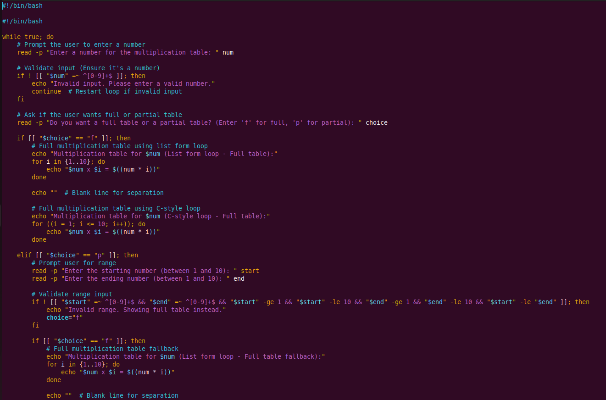

# linux_shell_scripting
Bash script for generating multiplication table
# Bash Multiplication Table Script

## Project Overview
This project is a **Bash script** that generates a multiplication table based on user input. The user is given the choice to generate either:
- A **full table** (from 1 to 10).
- A **partial table** (within a specified range).

Additionally, the script demonstrates **two types of loops**:
1. **List-style for loop** `{1..10}`
2. **C-style for loop** `for ((i = 1; i <= 10; i++))`

The script also includes **interactive features**, such as:
- **User input prompts**
- **Input validation**
- **Dynamic interaction** (users can retry with different numbers)

## Features & Implementation
### 1️⃣ **Using the List Form For Loop**
- The script first prompts the user to enter a number.
- If the user chooses a full table, the script uses a **list-style loop** `{1..10}` to iterate through numbers 1 to 10.
- Each iteration calculates the product and prints the result.

### 2️⃣ **Using the C-style For Loop**
- The script then uses a **C-style for loop**, which follows a `for ((i=start; i<=end; i++))` structure.
- This approach is **more flexible** and commonly used in other programming languages like C, Java, and Python.

### 3️⃣ **Handling User Input & Validation**
- Users **enter a number** for which the multiplication table will be generated.
- Users then **choose between a full or partial table**.
- If a **partial table is selected**, they provide the start and end values for the range.
- The script **checks for invalid inputs**, ensuring numbers are within the expected range (1–10).
- If an invalid range is entered, it **defaults to a full table**.

### 4️⃣ **Interactive Experience**
- The script **runs in a loop**, allowing users to generate multiple tables **without restarting**.
- Users can **exit** gracefully by choosing **'n'** when prompted.

---

## Code Implementation
Below is the complete script used for this project:

**📜 Image: Complete Script**

---

## Running the Script
To execute the script, ensure it has the necessary permissions:

    chmod +x multiplication_table.sh
    ./multiplication_table.sh

**📜 Image: Runnnig script**
 Executed the script, demonstrated the different scenarios where the user performed full calculation, partial calculation, and error handling when the user entered an unexpected variable #

